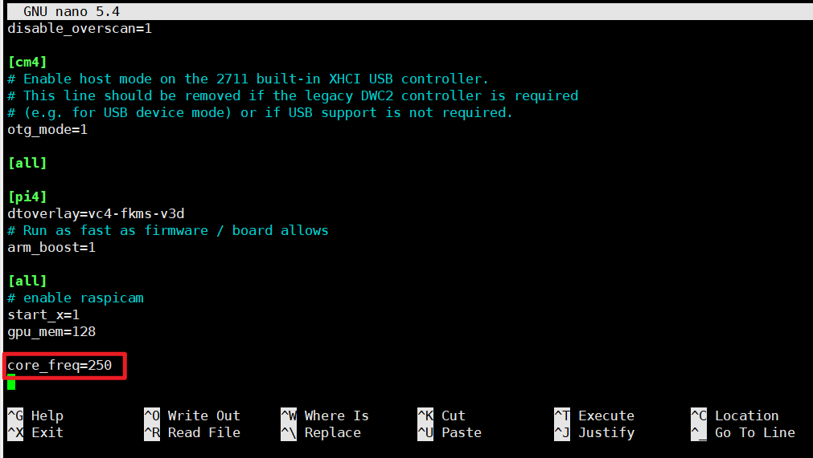
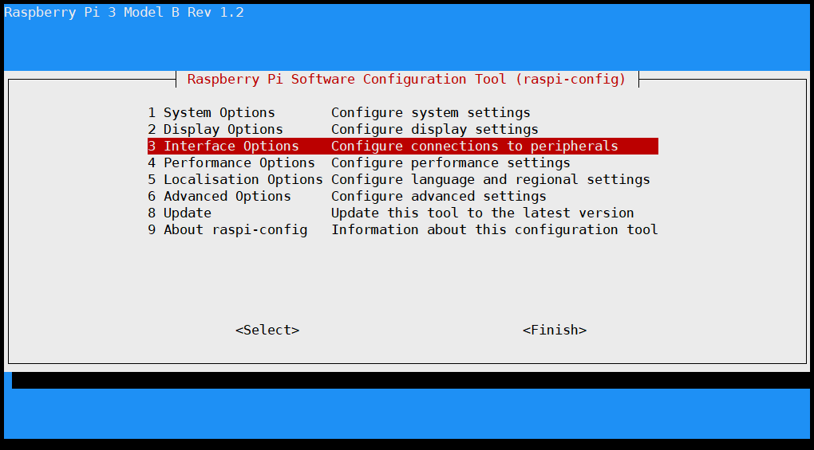
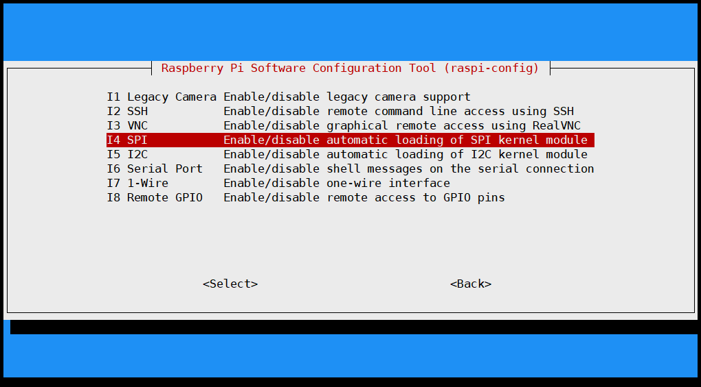
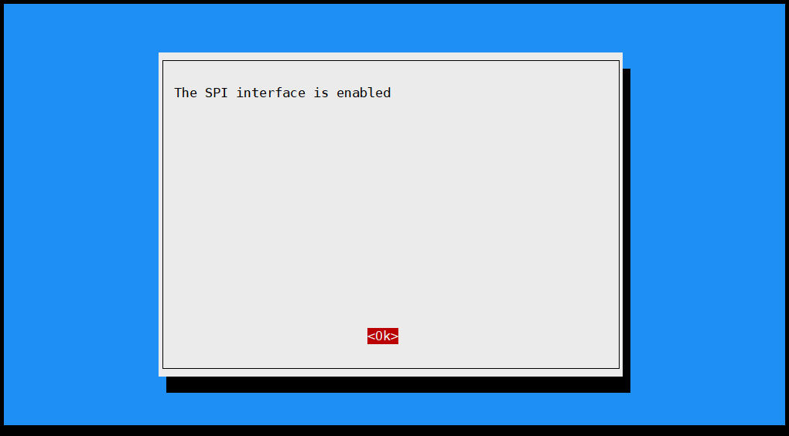

# 非常棒的项目，在此非常感谢 11chrisadams11


## 安装步骤

1. 安装配置相关依赖
   1. ```sudo apt update && sudo apt install -y git```
   2. ```sudo pip3 install requests PyYAML RPi.GPIO rpi_ws281x adafruit-circuitpython-neopixel```
   3. 新增步骤1：在 `/boot/config.txt` 文件末尾中添加这行代码 `core_freq=250`
      `sudo nano /boot/config.txt`,在末尾添加一行后，按 CTRL+O 写入，再按 CTRL+X 退出编辑器。
        

   4. 新增步骤2：开启 SPI interface
      ```sh
      sudo raspi-config
      ```
      依次选择 Interfaceing Options->P4 SPI->Yes(enable this spi interface)-> Ok -> Finish
        
        
        
        
      ```sh
      reboot
      ```
      重启后检查 SPI 状态
      ```sh
      lsmod |grep spi_bcm
      # 输出信息里有以下信息表明配置成功
      # spi_bcm2835 7596 0
      ```
      
2. 克隆项目
   1. ```cd /home/pi```
   2. ```git clone https://github.com/11chrisadams11/Klipper-WS281x_LED_Status.git```
      可选项：也可以克隆我调整好的代码 `https://github.com/lulee007/Klipper-WS281x_LED_Status.git`
   3. ```cd Klipper-WS281x_LED_Status```
3. 更改脚本权限，设置为可执行
   1. ```chmod 744 ./klipper_ledstrip.py```
   2. 测试灯带 `./klipper_ledstrip.py 红 绿 蓝 亮度`
      - 全白-最高亮度：`./klipper_ledstrip.py 255 255 255 255` 
      - 红色-默认亮度：`./klipper_ledstrip.py 255 0 0`
4. 修改 settings.conf 配置文件中的 LED pin, brightness, timeout
   可选项： 修改待机、暂停、错误等效果和颜色
5. 可选项：如果想测试下效果可以先手动启动脚本，然后再打印，或者按照下面的方式配置成服务方式自启动
   ```./klipper_ledstrip.py```
6. 以系统服务方式运行
   1. 复制 ledstrip.service 到 /etc/systemd/system/ledstrip.service
      `cp ledstrip.service /etc/systemd/system/ledstrip.service`
   2. 按需修改 `Modify User`, `Group`, `WorkingDirectory`, 和 `ExecStart`，这里用的默认配置即可。
   3. 重新加载来启用服务： ```systemctl daemon-reload```
   4. 设置开机自启动： ```systemctl enable ledstrip```
   5. 启动服务：```systemctl start ledstrip```
7. 修改settings.conf里的相关配置后需要重启服务
   ```systemctl restart ledstrip```
   **注意：** 如果 `shutdown_when_complete` 设置了 `True` 那么需要对 `[power printer]` 部分进行修改，否则将出现错误，详细配置见文档: https://moonraker.readthedocs.io/en/latest/configuration/#power
   ```conf
   [power printer]
   # 这里接入的是 homeassistant 智能家居系统的插座开关
   # token 需要从 homeassistant 系统中获取
   type: homeassistant
   address: 192.168.0.1
   port: 8123
   device: switch.wifi_socket_2
   token: ha_token_xxxxxx
   domain: switch
   ```
8. 可选项：使用GCODE调用
   1. 安装 gcode shell commands 
      1. 下载插件：https://github.com/th33xitus/kiauh/blob/master/resources/gcode_shell_command.py
      2. 放入 `/home/pi/klipper/klippy/extras`文件夹下
      3. 重启kilpper
   2. 添加如下配置到 `printer.cfg`
      ```
      [gcode_shell_command led_off]
      command: /home/pi/Klipper-WS281x_LED_Status/klipper_ledstrip.py 0 0 0
      timeout: 2.
      verbose: True

      [gcode_shell_command led_white]
      command: /home/pi/Klipper-WS281x_LED_Status/klipper_ledstrip.py 255 255 255
      timeout: 2.
      verbose: True

      [gcode_shell_command led_purple]
      command: /home/pi/Klipper-WS281x_LED_Status/klipper_ledstrip.py 255 0 255
      timeout: 2.
      verbose: True

      [gcode_macro LED_OFF]
      gcode:
         RUN_SHELL_COMMAND CMD=led_off

      [gcode_macro LED_WHITE]
      gcode:
         RUN_SHELL_COMMAND CMD=led_white

      [gcode_macro LED_PURPLE]
      gcode:
         RUN_SHELL_COMMAND CMD=led_purple
      ```
